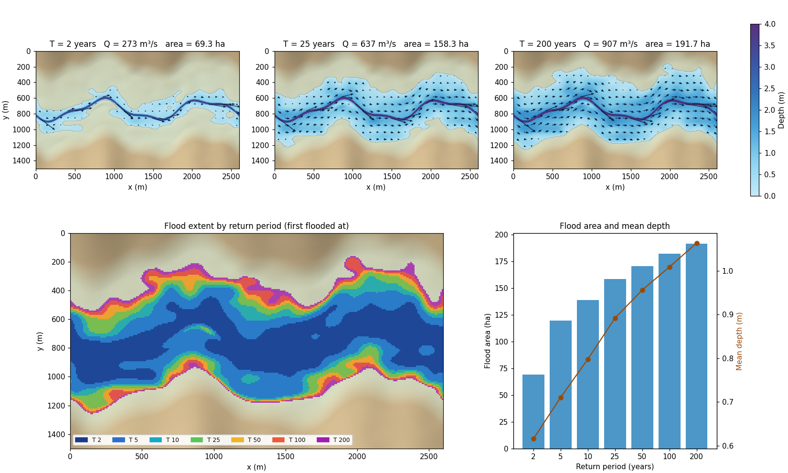

# Return-Period Flood Simulator

A browser-based flood simulation that compares **flood extent**, **depth** and **flow direction** for the 2, 5, 10, 25, 50, 100 and 200-year return periods. The app is one HTML file with no external libraries.

**Live demo:** `https://<username>.github.io/<repo-name>/` (after you enable GitHub Pages, see below)



*The preview is generated by `tools/reference_model.py`, a Python port of the same model.*

## Features

- Return-period buttons: T = 2, 5, 10, 25, 50, 100, 200 years
- Five map views: depth, flood extent, all return periods stacked, A | B swipe comparison, and B − A difference
- HEC-RAS-style flow arrows (length grows with velocity) plus animated tracer particles that follow the flow
- Cross-section, longitudinal profile, and return period vs area/depth charts
- Discharge from a Gumbel distribution, or entered manually (for example from HEC-HMS)
- Adjustable Manning n (channel and floodplain) and bed slope
- Export the results table (CSV) and the map (PNG)

## Repository contents

| Path | Purpose |
|---|---|
| `index.html` | The whole app (HTML, CSS and JavaScript) |
| `README.md` | This file |
| `LICENSE` | MIT license |
| `.nojekyll` | Tells GitHub Pages to serve files as they are |
| `.gitignore` | Files Git should ignore |
| `CITATION.cff` | Lets GitHub show a "Cite this repository" button |
| `docs/preview.png` | Preview image used in this README |
| `tools/gumbel_quantiles.py` | Fits a Gumbel distribution to your annual peak discharges and prints Q for T = 2 to 200 years |
| `tools/reference_model.py` | Python/NumPy version of the model, for cross-checking and for adapting to a real DEM |
| `data/example_annual_peaks.csv` | Synthetic example series for `gumbel_quantiles.py` |
| `data/results.csv` | Example output of `reference_model.py` |
| `requirements.txt` | Python packages for the optional tools |

## Run locally

Open `index.html` in a browser. No server or install is needed.

## Publish with GitHub Pages

1. Create a new repository and upload all files, keeping the folder structure.
2. Go to **Settings > Pages**.
3. Under **Build and deployment**, choose **Deploy from a branch**, branch `main`, folder `/ (root)`.
4. After a few minutes the site is live at `https://<username>.github.io/<repo-name>/`.

## Python tools (optional)

```bash
pip install -r requirements.txt

# Design discharges from your own annual peak series
python tools/gumbel_quantiles.py data/example_annual_peaks.csv

# Re-run the model and regenerate docs/preview.png and data/results.csv
python tools/reference_model.py
python tools/reference_model.py --mean 450 --cv 0.6
```

The Python model counts flooded area on the 10 m grid, while the browser counts it on a finer 3.3 m render grid, so areas differ by about 2 ha. Maximum depths match.

## How it works

1. The valley terrain is generated synthetically (meandering channel, floodplain, natural levee, low-lying depression, valley walls).
2. Peak discharge: Q_T = mean × (1 + K_T × Cv), where K_T is the Gumbel frequency factor.
3. At each cross-section the water surface elevation is solved from Manning's equation with strip-wise conveyance (different n for channel and floodplain).
4. The water surface is mapped across the grid. Only cells connected to the channel are flooded.
5. Local velocity is v = h^(2/3) · √S / n, directed along the valley axis. Arrows and particles visualise this field. Animation speed is a visual time-lapse, not real time.

## Limitations

This is an educational steady-flow model, not a replacement for HEC-RAS. It does not model flood-wave routing, backwater, bridges or true 2D flow. Flow directions follow the valley axis rather than a solved 2D momentum field. Use a real DEM, surveyed geometry and calibration for actual studies.

## Next steps

- Replace `buildTerrain()` with a DEM reader (for example ESRI ASCII grid)
- Replace `stage()` with a standard-step or diffusive-wave solver
- Add a land-cover based Manning n map

## License and citation

MIT License, see `LICENSE`. To cite, use the "Cite this repository" button on GitHub (from `CITATION.cff`).
